# warmachineX

## 交大之光
代码到实物课程_交大之光小组

## 1、团队介绍：
团队名称为交大之光，由陈海潮，杨雄，闫坤，袁舒蕾四个成员组成。团队创建于2020年，3月1日。该团队坚持虚心若渴，求知若愚的团风，以着创新未来，挑战自我的口号凝聚为一股力量。四名创始人都为2019级大一新生，倚着敢拼敢闯的精神，用大胆的想象勾勒未来蓝图。

## 2、人员分工：

职位	     姓名	       github id          工作

组长	    陈海潮      warmachineXX      模型建立

组员       杨雄         313902          代码编写

组员       闫坤	        A7kun           演讲展示

组员      袁舒蕾	      August1zz        产品设计

## 3、设计思考：
  我们小组设计的产品是一款帮助矫正坐姿的椅子，主要面向青少年，使得小朋友在成长时可以最大程度避免驼背的困扰。思路如下：通过在椅坐上放置压力传感器控制整个系统的开合，避免在无人时装置误触发，通过椅背上的红外测距装置，测出坐在椅子上的人背部的倾斜角度，当超过一定角度后，会触发振动电机发出轻微震动进行提醒。我们希望可以通过这样的产品减少驼背的困扰。思考：1.如果应用于学校，价格是否太高？2.学生如果总是驼背，是否会对一直提醒感到厌烦？

## 4、模型图纸展示：

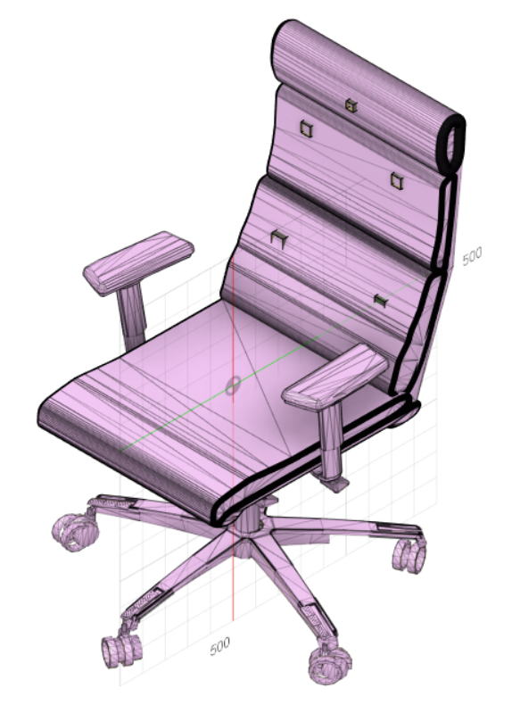
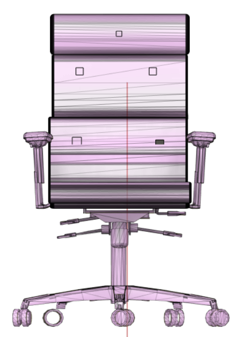
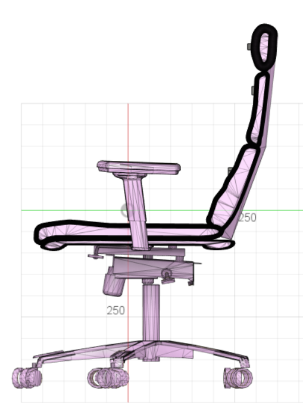
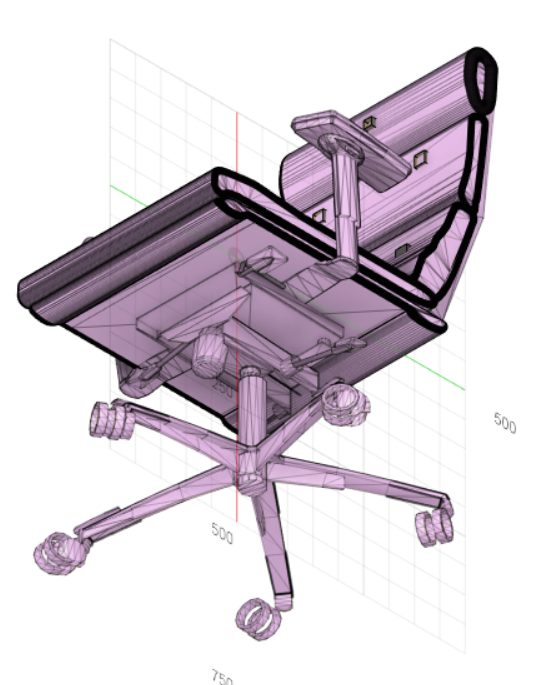
   
## 5、代码展示：

### 一，步进电机
功能：利用HX711模块读取压力值，之后通过步进电机实现压力的反馈
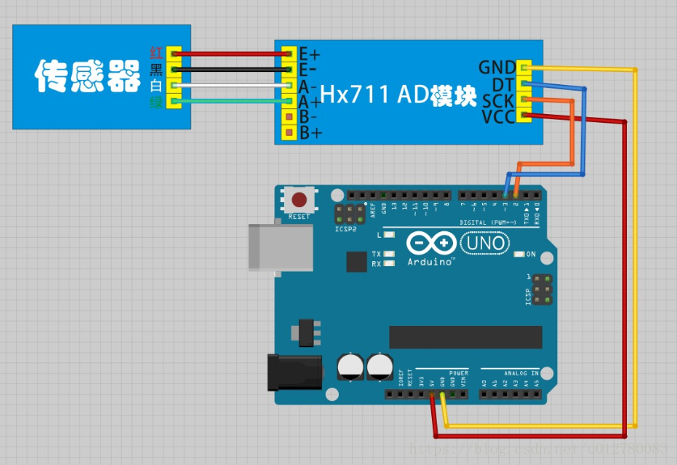
HX711接线图如图所示。

hx711读数为0.000（最大量程5Kg，小数点厚=后三位有效数字），步进电机按照煤千分位走2步（步进电机1.8°，无细分）的设计进行（百分位20步，十分位200步，个位2000步），附上代码：代码临时改写还有很多问题，应该增加一个中断判断每次的压力量，不应每次使x进行复位，以后有时间会继续修改：

#include <motor.h>

#include <HX711.h>

float Weight = 0;

void setup()

{   Serial.begin(9600);

  Init_motor();
  
  Init_Hx711();
  
  Serial.print("Welcome to use!\n");
  
  Get_Maopi();
  
  delay(3000);  }
  
void loop()

{  delay(100);

  int x = 0;
  
  Weight = Get_Weight();  //计算放在传感器上的重物重量
  
  Serial.print(float(Weight/1000),3); //串口显示重量
  
  Serial.print(" kg\n");  //显示单位
  
  Serial.print("\n");   //显示单位
  
  delay(200);        //延时1s
  
  x = abs(Weight);
  
  int x_1 = x/100;//x/100 *1 circle
  
  PUT_N_ForwardCircle(x_1);
  
  int x_2 = (x%100)/100;  //x%100/10  1/10;
  
  PUT_N_ForwardCircle(x_2);
  
  int x_3 = (((x%100)/10)%10)*2;
  
  PUT_N_Up_Step(x_3);
  
  delay(1000);
  
  PUT_N_BackCircle((x_1)+(x_2));
  
  PUT_N_Down_Step(x_3);   }
  
### 二，红外测距及红外发出装置
Arduino 读红外测距传感器GP2D12 实例，仅供大家参考！

器材：Arduino 开发板，GP2D12，1602 字符液晶，连接线若干。

GP2D12 是日本SHARP 公司生产的红外距离传感器，价格便宜，测距效果还不错，主要用于模型或机器人制作。

技术规格如下：

探测距离：10-80cm

工作电压：4-5.5V

标准电流消耗：33-50 mA

输出量：模拟量输出，输出电压和探测距离成比例

实验原理图
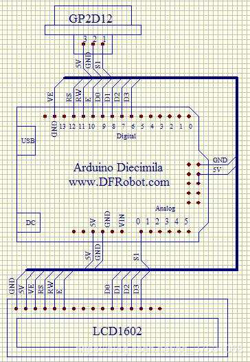
实验实物图：
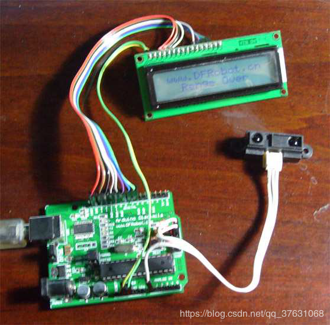
没有障碍物，显示范围超出
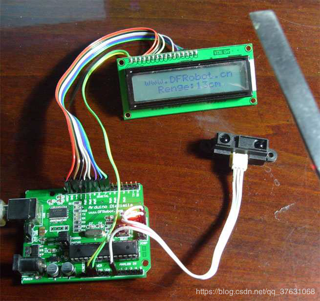
有障碍物时显示测量距离

经实验，需要在GP2D12 的电源端加个10UF 以上的电解电容，稳定供电电压，以保证输出模拟电压更稳定。

实验代码：

/********************************************************************/

int GP2D12=0;

int ledpin = 13;

int LCD1602_RS=12;

int LCD1602_RW=11;

int LCD1602_EN=10;

int DB[] = {6, 7, 8, 9};

char str1[]="www.DFRobot.cn";

char str2[]="Renge:00cm";

char str3[]="Renge Over";

/********************************************************************/

由于篇幅限制，1602 液晶部分程序省略。。。

/********************************************************************/
void setup (void)

{   int i = 0;

for (i=6; i <= 13; i++)

{   pinMode(i,OUTPUT);   }

LCD_Command_Write(0x28);//4 线 2 行 2x7

delay(50);

LCD_Command_Write(0x06);

delay(50);

LCD_Command_Write(0x0c);

delay(50);

LCD_Command_Write(0x80);

delay(50);

LCD_Command_Write(0x01);  }

/********************************************************************/

void loop (void)

{  float temp;

int val;

char i,a,b;

LCD_Command_Write(0x02);

delay(50);

LCD_Write_String(1,0,str1);

delay(50);

LCD_Write_String(3,1,str2);

delay(50);

while(1)

{  val = analogRead(GP2D12);

temp=val/5.8; //改变被除数，可以减小一点误差。

val=95-temp; //由于GP2D12 的输出电压与距离成反比，所以需要用一个常量相减

//改变这个常量，可以减小一点误差。

if(val>80)

{   
LCD_Write_String(3,1,str3); //超出范围显示 Renge Over  }

else
{  
 LCD_Write_String(3,1,str2);
 
a=0x30+val/10;

b=0x30+val%10;

LCD_Write_Char(9,1,a);

LCD_Write_Char(10,1,b);  
}
delay(500);  

 }  }
1、红外接收头的介绍

红外遥控器发出的信号是一连串的二进制脉冲码。为了使其在无线传输过程中免受其他红外信号的干扰,通常都是先将其调制在特定的载波频率（本实验是38KHZ）上,然后再经红外发射二极管发射出去,而红外线接收装置则要滤除其他杂波,叧接收该特定频率的信号并将其还原成二进制脉冲码,也就是解调。
内置接收管将红外发射管发射出来的光信号转换为微弱的电信号，此信号经由IC内部放大器进行放大，然后通过自动增益控制、带通滤波、解调、波形整形后还原为遥控器发射出的原始编码，经由接收头的信号输出脚输入到电器上的编码识别电路。
2、NEC协议的特点：

（1）8位地址位，8位命令位

（2）为了可靠性地址位和命令位被传输两次

（3）脉冲位置调制

（4）载波频率38khz

（5）每一位的时间为1.125ms或2.25ms

电路连接图如下，使用的是红外接收模块，也可以使用光电二
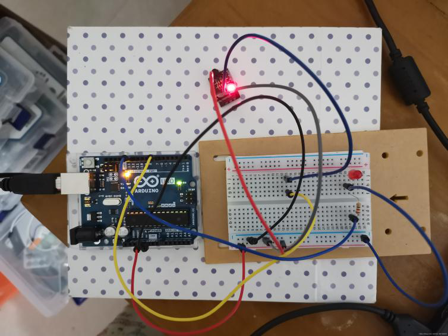
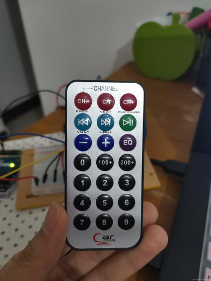
下载Arduino程序

打开 串口助手， 找个遥控 对红外一体接收头 按下 ， 串口助手就会显示 遥控每个按键的编码
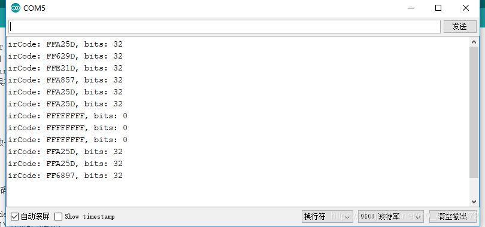

## 6、制作过程记录

## 7、凿物网制作教程的链接
